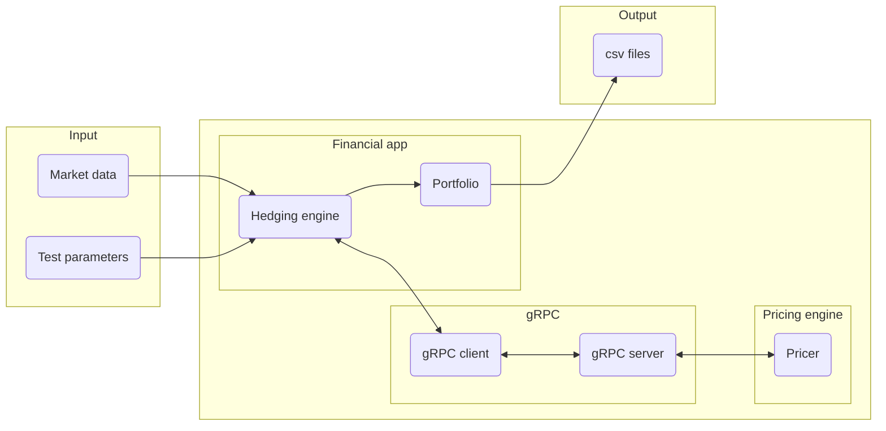

# Projet de couverture de produits multi-flux

## Présentation

L'objectif de ce projet est d'implémenter une application permettant de couvrir des produits dérivés dans un cadre plus général que celui du Projet de Couverture de Produits Dérivés: l'application développée permettra de couvrir des produits dérivés basés sur un calendrier réel, et versant plusieurs flux.

La réalisation de ce projet permettra à chaque élève:
- De comprendre de quelle façon peut être couvert un produit dérivé multiflux.
- D'implémenter de bout en bout une application composée de deux parties:
    - Une application *financière* à laquelle sont fournies les données financières, qui gère les dates de constatation et constitue le portefeuille de couverture.
    - Une application *mathématique*  dont le rôle est de calculer les quantités de sous-jacent à détenir dans le portefeuille de couverture.

## Payoff
 On considère un entier $`n\in \mathbb{N}`$ et on pose
 ```math
 \begin{align*}
 S &= (S_1, \ldots, S_n)\\
\mathcal{T} &= (t_1,\ldots, t_n)\\
\mathcal{K} &= (K_1,\ldots, K_n)\\
C_0 & = \Omega\\
C_i & = C_{i-1} \cap \left\{S_i(t_i) \leq K_i\right\}\\
P_i & = \left(S_i(t_i) - K_i\right)_+\cdot\mathbb{1}_{C_{i-1}}
 \end{align*}
 ```
 Le produit dérivé verse le flux
 $`P = \sum_{i=1}^n P_i`$, autrement dit, il verse le flux $`P_i`$ à la date $`t_i`$.

## Organisation, contraintes techniques
- Le projet devra être réalisé en binômes.
- L'application financière devra être codée en C# (.NET 6). Il s'agira d'une application console qui prend en entrée une configuration de produit et des données de marché, et fournit en sortie deux fichiers csv sans entête contenant pour l'un les champs date et prix théorique, et pour l'autre les champs date et valeur du portefeuille de couverture.
- Le coeur de calcul devra être codé en C++.
- La communication entre l'application financière et le coeur de calcul se fera à l'aide d'un client et d'un serveur gRPC.



## Etapes principales du projet

- Faire valider l'architecture et le principe mathématique de couverture
- Réussir à faire communiquer le client et le serveur grpc (squelettes)
- Implémentation d'un outil qui couvre un call vanille
- Implémentation d'un outil qui couvre un call avec barrière discrète
- Implémentation d'un outil qui couvre un produit versant $`2`$ flux
- Implémentation d'un outil qui couvre un produit versant $`n>2`$ flux

## Moteur de calcul

Le moteur de calcul codé en C++ utilisera les outils/libraires suivantes

- `CMake`
- Une version récente de `g++` ou `clang++`.
- [PNL](https://pnlnum.github.io/pnl) : installer la dernière version à partir de https://github.com/pnlnum/pnl/releases. Sous Ubuntu, il faut préalablement installer `libblas-dev`, `liblapack-dev` et `gfortran`.
- Une libraire de manipulation de fichiers `.json` en C++ : [nlohmann_json](https://github.com/nlohmann/). Cette librairie est disponible dans la plupart des gestionnaires de paquets
  - Homebrew : `brew install nlohmann-json`
  - Ubuntu : installer `nlohmann-json3-dev`.

  Voir un exemple d'utilisation dans [`PricerEngine/test_json_reader.cpp`](PricerEngine/test_json_reader.cpp).
- Installer `grpc` et `protobuf`
  - Homebrew : `brew install grpc`
  - Ubuntu : installer `protobuf-compiler` et `libgrpc++-dev`

### Lancement sous Windows
- **Prérequis**: avoir installé CMake (de préférence Cmake gui) et git sur la machine.
- Télécharger et installer *vcpkg* depuis github en suivant les [instructions fournies](https://github.com/microsoft/vcpkg#quick-start-windows).
- Se servir de *vcpkg* pour installer Protobuf, gRPC et nlohmann-json en version 64 bits:
    - .\vcpkg.exe install protobuf:x64-windows
    - .\vcpkg.exe install grpc:x64-windows
    - .\vcpkg.exe install nlohmann-json:x64-windows
- Dans Cmake-gui, ajouter les deux entrées suivantes:
    - CMAKE_PREFIX_PATH: chemin vers le dossier de libpnl qui contient les répertoires *lib* et *include*
    - CMAKE_TOOLCHAIN_FILE: chemin vers le fichier *[racine vcpkg]/scripts/buildsystems/vcpkg.cmake*


### FAQ

- **SSL is not found on OSX** : Avant de lancer `cmake`, exécuter `export PKG_CONFIG_PATH="/usr/local/opt/openssl/lib/pkgconfig"`
- **Intellisense does not find `pricing.grpc.pb.h`** : ajouter le répertoire de `build` à la liste des répertoires utilisés par intellisense. Sous VS Code, ajouter `${workspaceFolder}/PricerEngine/build` à `includePath`.
- Client .NET (*GrpcPricer.GrpcPricerClient* dans le code ci-dessous) invoquant un serveur via *http* au lieu de *https*: configurer le client de la façon suivante:
```{csharp}
var httpHandler = new HttpClientHandler();
// Return `true` to allow certificates that are untrusted/invalid
httpHandler.ServerCertificateCustomValidationCallback =
    HttpClientHandler.DangerousAcceptAnyServerCertificateValidator;
using var channel = GrpcChannel.ForAddress("http://localhost:5079",
    new GrpcChannelOptions { HttpHandler = httpHandler });
var client = new GrpcPricer.GrpcPricerClient(channel);
 ```


## Package Nuget *MultiCashFlow.Common* et sa documentation
- Le package est disponible à cette [adresse](https://www.dropbox.com/s/wrtus8e06i1jzaf/MultiCashFlow.Common.1.0.0.4.nupkg?dl=0)
- La documentation correspondante est disponible [ici](NugetDoc/index.md)

## Autres ressources
- Présentation des principes [SOLID](docs/PresentationSolid.pdf)

